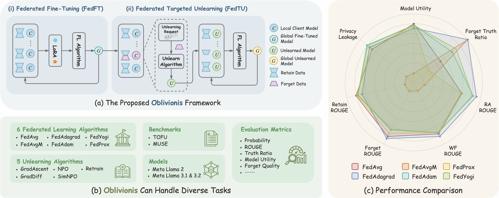

<h1 align="center">
  Oblivionis: A Lightweight Learning and Unlearning Framework for Federated Large Language Models
</h1>
<p align="center">
  <a href="https://arxiv.org/abs/2508.08875">
    </a>
  &nbsp;&nbsp;
  <a href="https://fyzhang1.github.io/Oblivionis/"></a>
  &nbsp;&nbsp;
  <a href="https://github.com/fyzhang1/Oblivionis/blob/main/LICENSE">
    </a>
</p>
<p align="center">
  <a href="https://github.com/fyzhang1">Fuyao Zhang</a><sup>1,*</sup>, 
  <a href="https://github.com/Tristan-SHU">Xinyu Yan</a><sup>1,*</sup>, 
  <a href="https://scholar.google.com/citations?user=7YsN6lMAAAAJ">Tiantong Wu</a><sup>1</sup>, 
  <a href="https://imamtom.github.io/">Wenjie Li</a><sup>1,2</sup>, 
  Tianxiang Chen</a><sup>1</sup>,<br>
  <a href="https://yangcao888.github.io/">Yang Cao</a><sup>3</sup>, 
  <a href="https://ranyan.w3spaces.com/">Ran Yan</a><sup>1</sup>, 
  <a href="https://scholar.google.com/citations?user=EQDfV9cAAAAJ">Longtao Huang</a><sup>4</sup>, 
  <a href="https://sites.google.com/view/wyb">Wei Yang Bryan Lim</a><sup>1,†</sup>, 
  <a href="https://www.polyu.edu.hk/dsai/docdrive/personal/yangqiang.html">Qiang Yang</a><sup>5</sup>
</p>

<p align="center">
  <sup>1 </sup>Nanyang Technological University
  <sup>2 </sup>Hebei Normal University,<br>
  <sup>3 </sup>Institute of Science Tokyo
  <sup>4 </sup>Alibaba Group
  <sup>5 </sup>Hong Kong Polytechnic University
</p>


---


This repo is the official implementation of **Oblivionis** proposed by our paper ["Oblivionis: A Lightweight Learning and Unlearning Framework for Federated Large Language Models"](https://arxiv.org/abs/2508.08875).

**Oblivionis** is a Python framework for the reproduction and development of the learning and unlearning of Federated Large Language Models research. It integrates 6 representative federated learning algorithms, 5 machine unlearning methods, 2 federated fine-tuning methods (full-parameter and LoRA-based), and a variety of models. **Oblivionis** also supports 5 datasets and over 10 evaluation metrics.

## 📃 Changelog

- **[2025-11-08]** 🔥 Oblivionis has been accepted by AAAI 2026.
- **[2025-08-13]** The preprint version of our paper was published on [arXiv](https://arxiv.org/abs/2508.08875).
- **[2025-08-04]** We released the first version of **Oblivionis** on GitHub.

---

## 🗺️ Navigation

- [📖 Introduction](#-introduction)
- [📃 Changelog](#-changelog)
- [⚡ Quick Start](#-quick-start)
- [🧪 Experiments](#-experiments)
  - [📚 Retain](#-retain)
  - [🎯 Finetune](#-finetune)
  - [✂️ Unlearn](#-unlearn)
  - [📊 Evaluation](#-evaluation)
  - [🧭 Baseline](#-baseline)

- [🔎 Roadmap](#-roadmap)
- [🤝 Acknowledgment](#-acknowledgment)
- [🔖 License](#-license)
- [📄 Citation](#-citation)

## 📖 Introduction

Large Language Models (LLMs) increasingly leverage Federated Learning (FL) to utilize private, task-specific datasets for fine-tuning while preserving data privacy. However, while federated LLM frameworks effectively enable collaborative training without raw data sharing, they critically lack built-in mechanisms for regulatory compliance. Integrating private data heightens concerns over data quality and long-term governance, yet existing distributed training frameworks offer no principled way to selectively remove specific client contributions post-training. Due to distributed data silos, stringent privacy constraints, and the intricacies of interdependent model aggregation, federated LLM unlearning is significantly more complex than centralized LLM unlearning.

To address this gap, we introduce **Oblivionis**, a lightweight learning and unlearning framework that enables clients to selectively remove specific private data during federated LLM training, enhancing trustworthiness and regulatory compliance.



<p align="center">Figure 1. Overview of the proposed <b>Oblivionis</b> framework.
</p>


## ⚡ Quick Start

To get started with **Oblivionis**, you can simply install it with git, conda and pip:

```shell
# Download
git clone https://github.com/fyzhang1/Oblivionis.git
cd Oblivionis

# Set up & Install
conda create -n Oblivionis python=3.12
conda activate Oblivionis
pip install -r requirements.txt
pip install flash-attn --no-build-isolation
```

## 🧪 Experiments

Here, we use the default configuration file with the **TOFU** benchmark as the example. If you need to customize the experiment for your research, please modify the following files:

- **Main Configurations**: `configs/train-lora.yaml` and `configs/unlearn-lora.yaml`
- **Trainer Configurations**: `configs/trainer/FederatedFinetune.yaml` and `configs/trainer/FederatedUnlearningTrainer.yaml`
- **Experiment Settings**: `configs/experiment/`
- **Datasets**: `configs/data/`

### 📚 Retain

```shell
python src/federated_train.py \
  --config-name=train-lora.yaml \
  experiment=finetune/tofu/default.yaml \
  task_name=${retain_task_name} \
  data/datasets@data.train=TOFU_QA_retain \
  data.train.TOFU_QA_retain.args.hf_args.name=${retain_split} \
  paths.output_dir=saves/retain/${retain_task_name}
```

### 🎯 Finetune

```shell
python src/federated_train.py \
  --config-name=train-lora.yaml \
  experiment=finetune/tofu/default.yaml \
  task_name=${finetune_task_name} \
  data/datasets@data.train=TOFU_QA_full \
  data.train.TOFU_QA_full.args.hf_args.name=full \
  paths.output_dir=saves/finetune/${finetune_task_name}
```

### ✂️ Unlearn

```shell
python src/federated_train.py \
  --config-name=unlearn-lora.yaml \
  experiment=unlearn/tofu/default.yaml \
  forget_split=${forget_split} \
  retain_split=${retain_split} \
  trainer=FederatedUnlearningTrainer \
  task_name=${unlearn_task_name} \
  model.model_args.pretrained_model_name_or_path=saves/finetune/${finetune_task_name} \
  retain_logs_path=saves/eval/${retain_task_name}/TOFU_EVAL.json \
  paths.output_dir=saves/unlearn/${unlearn_task_name}
```

### 📊 Evaluation

```shell
# Retain
python src/eval.py \
  experiment=eval/tofu/default.yaml \
  forget_split=${forget_split} \
  holdout_split=${holdout_split} \
  task_name=${retain_task_name} \
  model.model_args.pretrained_model_name_or_path=saves/finetune/${retain_task_name} \
  paths.output_dir=saves/eval/${retain_task_name} \
  hydra.run.dir=saves/eval/${retain_task_name}

# Finetune
python src/eval.py \
  experiment=eval/tofu/default.yaml \
  forget_split=${forget_split} \
  holdout_split=${holdout_split} \
  task_name=${finetune_task_name} \
  model.model_args.pretrained_model_name_or_path=saves/finetune/${finetune_task_name} \
  retain_logs_path=saves/eval/${retain_task_name}/TOFU_EVAL.json \
  paths.output_dir=saves/eval/${finetune_task_name}/${forget_split} \
  hydra.run.dir=saves/eval/${finetune_task_name}/${forget_split}

# Unlearn
python src/eval.py \
  experiment=eval/tofu/default.yaml \
  forget_split=${forget_split} \
  holdout_split=${holdout_split} \
  task_name=${unlearn_task_name} \
  retain_logs_path=saves/eval/${retain_task_name}/TOFU_EVAL.json \
  model.model_args.pretrained_model_name_or_path=saves/unlearn/${unlearn_task_name} \
  hydra.run.dir=saves/eval/${unlearn_task_name} \
  paths.output_dir=saves/eval/${unlearn_task_name}
```

### 🧭 Baseline

To reproduce the results in **Table 2** and **Figures 3-4** of our paper, please run the shell script `1B-FedAvg-TOFU-Split99.sh` inside the `scripts` folder.


<p align="center">Figure 2. Sample results of reproduction.
</p>


## 🔎 Roadmap

**Oblivionis** is still under development, and there is plenty of room for improvement. We will continue to update it and sincerely welcome suggestions and contributions to this open-source toolkit. If you encounter any issues or have questions, please feel free to open an issue in this repository.

Looking ahead, we plan to gradually include the following components:

- ⏳ Benchmark Datasets
- ⏳ Evaluation Metrics
- and more...

## 🤝 Acknowledgment

- This paper is inspired by [OpenFedLLM](https://github.com/rui-ye/OpenFedLLM) and [OpenUnlearning](https://github.com/locuslab/open-unlearning), and also developed based on OpenUnlearning.
- Our implementation is built upon the [TOFU](https://github.com/locuslab/tofu) and [MUSE](https://github.com/swj0419/muse_bench) benchmarks.

## 🔖 License

**Oblivionis** is licensed under the MIT License. Please see the [`LICENSE`](https://github.com/fyzhang1/Oblivionis/blob/main/LICENSE) file for details.

## 📄 Citation

If you find this work useful, please kindly consider citing our paper:

```bibtex
@article{zhang2026oblivionis,
  author    = {Zhang, Fuyao and Yan, Xinyu and Wu, Tiantong and Li, Wenjie
               and Chen, Tianxiang and Cao, Yang and Yan, Ran
               and Huang, Longtao and Lim, Wei Yang Bryan and Yang, Qiang},
  title     = {Oblivionis: A Lightweight Learning and Unlearning Framework
               for Federated Large Language Models},
  journal   = {Proceedings of the AAAI Conference on Artificial Intelligence},
  volume    = {40},
  number    = {33},
  pages     = {28185–28193},
  year      = {2026},
  month     = {Mar.},
  doi       = {10.1609/aaai.v40i33.40045},
  url       = {https://ojs.aaai.org/index.php/AAAI/article/view/40045},
}
```
